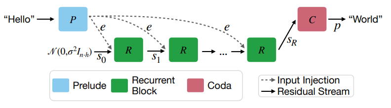
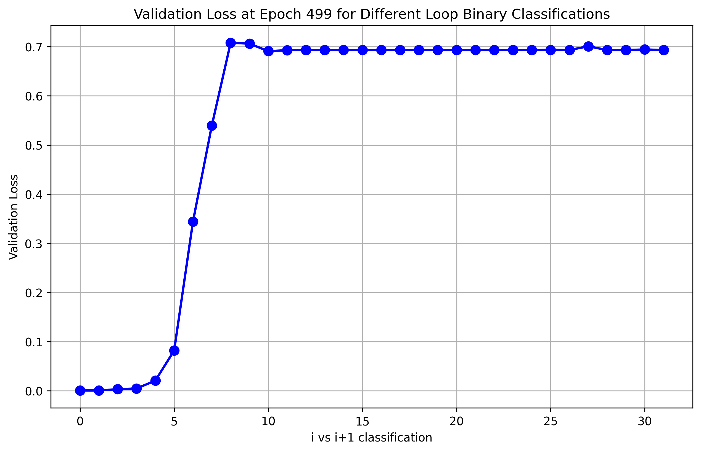

# Exploring Adaptive Compute with Recurrent Depth Transformers

 Authors: Max Yu, Zheyang Xiong* 

<small><i> *Zheyang took an Advisory Role </i></small>

<!-- ## Introduction -->
Recently with [Huginn](https://huggingface.co/tomg-group-umd/huginn-0125), Recurrent Depth Transformers have shown promise. Notably, these models can utilize a varying amount of compute (loops) to generate a single token. As shown in Huginn's initial studies, different tokens converge at different rates, and in an ideal world, we can use less compute to generate easy tokens and more compute to generate hard tokens. (Geiping et al., 2025)

We set out in pursuit of this vision and trained a small exit model.

This report is an informal one, where we document our approach, some interesting findings, and ultimately why adaptive compute is not yet feasible with such an architecture. **Yes, spoilers, this project failed, so feel free to skip to the latter sections.**

*NOTE: while there are other works regarding Recursive/Loop Transformers (Yang et al., 2023; Saunshi et al., 2025; and more), Huginn is the only large model (>1B params) with publicly available weights and support for arbitrary recurrent depths I know of at the time of writing (2025.07.20). As such, this project focuses on Huginn, with hopes that these results are mostly generalizable to future members of the architecture family.*

## Background and Motivations
Huginn is a Recurrent Depth Transformer, where the middle layers can iterate for any number of times. The more iterations it runs, the higher quality the resulting output is.

**Figure 1:** Diagram of Huginn's Architecture from their paper. (Geiping et al., 2025)

In contrast to sparse models like MoEs, these Recurrent Depth Transformers are dense models, where during test-time they have a many times larger effective parameter count than actual. For example, running Huginn with $r=32$ is effectively activating $2 + 1.5*32=50B$ parameters, even though there are only $3.5B$ unique parameters.

While a Recurrent Depth Transformer of size $k$ with $L$ loops theoretically can perform competitively to a normal model of size $kL$ (Saunshi et al., 2025), in practice with the $3.5B$ Huginn model at least, they report benchmark results closer to ~$10B$ models while running with $50B$ ($r=32$) effective parameters (albeit with less training tokens). One way to look at this gap is that there are inefficiencies; in Huginn's paper, they report tokens converging at different speeds. Ideally, we can spend just the right amount of compute for each token, where we adaptively early exit and save compute.

One might wonder, during generation, what about missing KV-cache entries when a prior token exits early? Huginn is able to address this through the Recurrent Depth Transformer architecture itself.

> We attend to the last, deepest available KV states in the cache. Because all recurrent KV cache entries are generated by the same K,V projection matrices from successive hidden states, they “match”, and therefore the model is able to attend to the latest cache entry from every previous token, even if computed at different recurrent depths. (Geiping et al., 2025)

This motivated Huginn's authors to test out several "adaptive compute" heuristics, such as measuring whether latent state distance and output token entropy converged. 

Hoping to do better, we set out to find a learnable method for both better accuracy and more generalizability.

## Predicting Early Exits using Reinforcement Learning
We apply reinforcement learning to train a binary policy model that aims to identify "early exits" with results close to running the Recurrent Depth Transformer $\mathcal{M}(x,r_{max})$ with recurrence $r=r_{max}$, but as early as possible.

Building on Huginn's intuition of using heuristics to identify when a token converges, we set out to build a small model to learn when to early exit.

If we think of the problem as trying to train a binary policy model $\pi_\theta$ that identifies whether to exit or not, Reinforcement Learning becomes a natural choice. Even better, if we think of the number of compute loops as states, we end up with a finite number of states that we can model as a Markov Decision Process.

So then, given a maximum recurrence $r=r_{max}$, the set of states $S=\{s_0, s_1, \dots, s_{r_{max}}\}$, a binary stochastic policy $\pi_\theta (a\mid s)$ over actions $A=\{\text{continue}, \text{exit}\}$, a reward function $\mathcal{R}:S\rightarrow\mathbb{R}$, and a discount factor $\gamma\in[0,1)$, the expected return from state $s_k$ can be expressed recursively as

$$
V_\pi(s_k) = \pi_\theta(\text{exit}\mid s_k)\mathcal{R}(s_k) + \gamma\pi_\theta(\text{continue}\mid s_k)V_\pi(s_{k+1})
$$

For the learning objective, we want to have the closest results as $r=r_{max}$ while using the least amount of loops. Hence, the reward function should represent similarity between $r=k$ and $r=r_{max}$. For example, we can start with

$$
\mathcal{R}(s_k) = -\text{CrossEntropy}(o(s_k), o(s_{r_{max}}))
$$

where $o$ is computing Huginn's output logits from $s$.

Note that the states $S$ is deliberately kept vague. This is because there is significant freedom in choosing $S$, as long as it is tied to the number of recurrences. For example:
- $s_i:=(v_{i-1}, v_i)$, if we're looking to model the difference between previous and current latent, where $v_i$ is $\mathcal{M}(x,r_{max})$'s latent vector at depth $i$.
- $s_i:=(v_0,\dots,v_i)$ if we want to model against the sequence of latents and how it changes.
- $s_i:=(p_{i-1}, p_i)$, if we want to model convergence of output logits, where $p_i$ is the output logits from $v_i$. **(This is impractical in practice since the computation cost of computing $p_i$ is as much as computing the next $v_{i+1}$.)**

### Implementation
In practice, we reformulate the reward into a loss function by negating it, and interpret the discount factor $\gamma$ as a penalty multiplier. Although maximizing the expected return $V^\pi(s_0)$ would be sufficient in principle, backpropagating through the full return can lead to prohibitively long computational graphs. To mitigate this, for each state $s_k$, we approximate the next-state value $V^\pi(s_{k+1})$ with a fixed target $\hat{V}_{k+1}$ and optimize the surrogate loss

$$
\mathcal{L} = \sum_{k=0}^{r_{\max}} \left( -\pi_\theta(\text{exit} \mid s_k) \, \mathcal{R}(s_k) - \gamma \, \pi_\theta(\text{continue} \mid s_k) \, \hat{V}_{k+1} \right)
$$

where the negative sign arises from converting the maximization of return into a minimization objective.

For the exit model $\pi_\theta$, we experimented with several architectures, and settled on a 1-layer transformer with positional embeddings that operate over the latents for each loop. So we define our states as $s_i:=(v_0,\dots,v_i)$, where $v_i$ is $\mathcal{M}(x,r_{max})$'s latent vector at depth $i$. Instead of attending to the latents of past tokens, this model attends to the latents of prior loops for the same token.

To efficiently train such an exit model, we can parallelize the training with $BatchSize\times SeqLen$, similar to Auto-Regressive Language Model training.
1. Use a pretraining dataset like RedPajama, sample $x$, which is a $BatchSize\times SeqLen$ tensor
1. Run the Loop Transformer $\mathcal{M}(x,r_{max})$ and capture the intermediate latents $v_0,\dots,v_{r_{max}}$
1. Compute and train the exit model $\pi_\theta$ with gradient of $\mathcal{L}$

### Results
The validation loss was able to beat the fixed iteration baseline by roughly one loop. E.g., on the validation set, the model achieves a validation loss close to $r=16$ with average loops close to $r=15$.

| Recurrences                            | Validation Loss |
|----------------------------------------|-----------------|
| $r=14$                                 | 2.07807         |
| $r=15$                                 | 2.07573         |
| **adaptive** ($\mathbb{E}[r] = 14.79$) | 2.07487         |
| $r=16$                                 | 2.07408         |
| $r=17$                                 | 2.07289         |

Unfortunately, in practice adaptive compute comes with some inefficiencies such as being much harder to batch. As such, this compute saving is not enough for practical usages, but it does show promise.

That is, until we started running [actual benchmarks](#finding-mixed-depth-attention-doesnt-work).

## Finding: Mixed Depth Attention Doesn't Work
Unfortunately, while the validation loss for our exit model was promising, the actual benchmark results were abysmal.

|                                  | arc-easy | hellaswag (1000-samples) |
|----------------------------------|----------|--------------------------|
| **adaptive** ($r_{avg} = 26.5$)  | 37.46    | 33.8                     |
| $r=0$                            | 25.54    | 26.15                    |
| $r=4$                            | 52.82    | 46.6                     |
| $r=8$                            | 61.74    | 53.2                     |
| $r=12$                           | 63.43    | 56.3                     |
| $r=16$                           | 64.27    | 56.9                     |

*NOTE: To run the above benchmarks, we implement an auto-regressive forward function similar to generation, but to compute logits. It doesn't sample for next tokens, but instead fills the KV cache token by token. This is painfully slow compared to the normal batched forward pass, but it helps us evaluate the FLOPs savings. And we only evaluated on hellaswag with 1000 samples due to compute resource limitations*

As previously mentioned, when using adaptive compute auto regressively, if prior tokens adaptively early exit, we use the deepest previously available latents to compute attention for later tokens. Only this way do we not need to recompute missing latents. This was all based on the understanding that:

> Because all recurrent KV cache entries are generated by the same K,V projection matrices from successive hidden states, they “match”, and therefore the model is able to attend to the latest cache entry from every previous token, even if computed at different recurrent depths. (Geiping et al., 2025)

Running some more experiments, we realized that even though this assumption is true to some degree, the quality of attention falls off drastically.

We run benchmarks while alternating the number of loops for each token. E.g., "$4/8$-alt" means odd-position tokens are 4 loops while even tokens are 8 loops. We assumed that even if this was not optimal, such $i/j$ alterations would at least yield similar performances as $r=\text{min}(i,j)$. 

  <!-- Table 1 -->
  <table border="1" cellpadding="6" cellspacing="0" style="border-collapse: collapse;">
    <thead>
      <tr>
        <th></th>
        <th>arc‑easy</th>
        <th>hellaswag (1000‑samples)</th>
      </tr>
    </thead>
    <tbody>
      <tr><td>r = 0</td>   <td>25.54</td> <td>26.15</td></tr>
      <tr><td>r = 4</td>   <td>52.82</td> <td>46.6</td></tr>
      <tr><td>r = 8</td>   <td>61.74</td> <td>53.2</td></tr>
      <tr><td>r = 12</td>  <td>63.43</td> <td>56.3</td></tr>
      <tr><td>r = 16</td>  <td>64.27</td> <td>56.9</td></tr>
      <tr><td>4/8‑alt</td>     <td>48.36</td> <td>42.7</td></tr>
      <tr><td>12/16‑alt</td>   <td>54.12</td> <td>49.4</td></tr>
      <tr><td>13/16‑alt</td>   <td>57.15</td> <td>52.2</td></tr>
      <tr><td>14/16‑alt</td>   <td>61.95</td> <td>54.3</td></tr>
      <tr><td>15/16‑alt</td>   <td>64.18</td> <td>56.7</td></tr>
    </tbody>
  </table>

  <!-- Table 2 -->
  <table border="1" cellpadding="6" cellspacing="0" style="border-collapse: collapse;">
    <thead>
      <tr>
        <th></th>
        <th>arc‑easy</th>
        <th>hellaswag (1000‑samples)</th>
      </tr>
    </thead>
    <tbody>
      <tr><td>8/0‑alt</td>   <td>34.64</td> <td>33.4</td></tr>
      <tr><td>8/1‑alt</td>   <td>34.76</td> <td>34.8</td></tr>
      <tr><td>8/2‑alt</td>   <td>38.01</td> <td>39.6</td></tr>
      <tr><td>8/3‑alt</td>   <td>39.86</td> <td>41.1</td></tr>
      <tr><td>8/4‑alt</td>   <td>41.84</td> <td>43.2</td></tr>
      <tr><td>8/5‑alt</td>   <td>44.99</td> <td>46.2</td></tr>
      <tr><td>8/6‑alt</td>   <td>50.51</td> <td>49.6</td></tr>
      <tr><td>8/7‑alt</td>   <td>57.62</td> <td>52.6</td></tr>
      <tr style="background-color:rgb(252, 252, 168);">
        <td><strong>r = 8</strong></td>
        <td><strong>61.74</strong></td>
        <td><strong>53.2</strong></td>
      </tr>
      <tr><td>8/9‑alt</td>   <td>61.87</td> <td>52.9</td></tr>
      <tr><td>8/10‑alt</td>  <td>59.47</td> <td>50.4</td></tr>
      <tr><td>8/11‑alt</td>  <td>55.43</td> <td>48.4</td></tr>
      <tr><td>8/12‑alt</td>  <td>52.44</td> <td>46.5</td></tr>
      <tr><td>8/13‑alt</td>  <td>51.47</td> <td>47.4</td></tr>
      <tr><td>8/14‑alt</td>  <td>51.43</td> <td>47.2</td></tr>
      <tr><td>8/15‑alt</td>  <td>52.44</td> <td>46.8</td></tr>
      <tr><td>8/16‑alt</td>  <td>52.78</td> <td>47.0</td></tr>
    </tbody>
  </table>

These results show that when mixing attentions between different loops, the bigger the difference in recurrent depth, the worse the results. And this penalty outweighs increases in total compute. For example, $8/12$-alt only performs close to $r=4$, even though it spends 2.5 times the total compute.

In hindsight, this is an example of **"you get what you trained for"**. While the Huginn model is trained to run with any number of recurrent loops, due to how we pretrain AR language models, it was only trained on a "uniform depth". Where all tokens in the sequence ran for the same number of loops. Due to the structure of the recurrent block, at its worst, the attention still works, e.g. $8/16$-alt still yields similar results as $r=4$, but there is a significant penalty.

### How Does Our Exit Model Training Differ From Generation?
You may be wondering, how come we were getting good losses when training our exit model, but terrible benchmark results? This is because we didn't have any missing KV entries/recurrence depths during training. Due to our batched setup, we always computed full latents $v_0, \dots, v_{r_{max}}$ directly through Huginn's fixed recurrence forward pass, and then using those latents, computed the various rewards $\mathcal{R}(s_k)$. On the other hand, at inference time, we have latents missing at various depths and positions, and we compute attention with mixed recurrent depth.

In other words, we were computing theoretical losses from combinations of the outputs of $\mathcal{M}(x,1),\dots,\mathcal{M}(x,r_{max})$, without realizing that having a combination of recurrence depths during generation was not equivalent.

### Does This Contradict Huginn's Results?
**NO**. There are a few factors at play here:
1. In Huginn's adaptive compute experiments, they prefill with a forward pass, meaning they use the same (max) number of recurrences for the initial input. This helps stabilize the initial prompt, and in few-shot benchmarks stabilize the CoT as well.
1. Performance highly depends on whether key tokens use roughly the same amount of loops, and the variance in recurrent depths chosen across the sequence.
1. Even though there is a dropoff, we can see that in the table, most combinations at least yield performance on par with $r=4$. So it does work as claimed, it just doesn't work well enough to be worth it.

Jonas Geiping further experimented with running heuristic adaptive exits with GSM8k with a 8-shot CoT setup, and he achieved **comparable accuracy with less compute than the original model.** But in a 0-shot setup with GSM8k, we end up with a 0% accuracy using the latent-diff heuristic exit scheme. This again can be explained by the impact of uniform recurrence prefilling.

## Conclusion
While it was disappointing we weren't able to train a viable adaptive exit policy model, it was a fun and intellectually challenging endeavor.

The most important takeaway is that to truly utilize adaptive compute, **the model will need support for mixed-iteration attention from training**. It is not obvious to us how this can be trained for without sacrificing significant model quality and training efficiency, but hopefully, others can figure this out.

And a new paper that was released as we were writing this blog post also points in an interesting direction. The Mixture of Recursions (Bae et al., 2025) architecture promises native adaptive compute support, where during pretraining the architecture already learns to use varying amounts of compute on different tokens by treating different recurrence depths as an expert routing problem. Still waiting for them to publish their model weights to investigate further, but looking forward to it.

## Acknowledgements
I'd like to thank Jonas Geiping for his incredible support and insights! This project would not look the same without his help. For example, he first pointed out the potential impacts of different mixed-depth KV cache implementations, which eventually led us to discover the true impact of depth mixing.

## Code
More useful pieces of code for this project has been upstreamed to the [Huginn github repo](https://github.com/seal-rg/recurrent-pretraining), while remainder has been published in a raw manner under [my fork](https://github.com/maxyu1115/recpre-adapt/blob/adaptive-exit/recpre_adapt).
- Script to reproduce results with alternating exits: [https://github.com/seal-rg/recurrent-pretraining/blob/main/evaluate_raven/misc_benchmark_variants/eval_alternate_loops.py](https://github.com/seal-rg/recurrent-pretraining/blob/main/evaluate_raven/misc_benchmark_variants/eval_alternate_loops.py)
- Script to reproduce loop classification results: [https://github.com/seal-rg/recurrent-pretraining/blob/main/scripts/classify_loops.py](https://github.com/seal-rg/recurrent-pretraining/blob/main/scripts/classify_loops.py)
- Setup to train the small exit model: [https://github.com/maxyu1115/recpre-adapt/blob/adaptive-exit/recpre_adapt/train.py](https://github.com/maxyu1115/recpre-adapt/blob/adaptive-exit/recpre_adapt/train.py)

## References

1. Sangmin Bae, Yujin Kim, Reza Bayat, Sungnyun Kim, Jiyoun Ha, Tal Schuster, Adam Fisch, Hrayr Harutyunyan, Ziwei Ji, Aaron Courville, and Se-Young Yun. Mixture-of-recursions: Learning dynamic recursive depths for adaptive token-level computation. arXiv preprint arXiv:2507.10524, 2025.
1. Jonas Geiping, Sean McLeish, Neel Jain, John Kirchenbauer, Siddharth Singh, Brian R Bartoldson, Bhavya Kailkhura, Abhinav Bhatele, and Tom Goldstein. Scaling up test-time compute with latent reasoning: A recurrent depth approach. arXiv preprint arXiv:2502.05171, 2025.
1. Nikunj Saunshi, Nishanth Dikkala, Zhiyuan Li, Sanjiv Kumar, and Sashank J Reddi. Reasoning with latent thoughts: On the power of looped transformers. arXiv preprint arXiv:2502.17416, 2025.
1. Liu Yang, Kangwook Lee, Robert Nowak, and Dimitris Papailiopoulos. Looped transformers are better at learning learning algorithms. arXiv preprint arXiv:2311.12424, 2023.

## Citation

@misc{yu2025exploring,
  author = {Max Yu and Zheyang Xiong},
  title  = {Exploring Adaptive Compute with Recurrent Depth Transformers},
  year   = {2025},
  url    = {https://maxyu1115.github.io/recpre-adapt}
}


## Additional Finding: the Recurrent Latent Space Consists of Subspaces

Originally, one would imagine the recurrent block to operate in a $f:V\rightarrow V$ fashion, where it transforms a latent vector into a new vector in the same latent space.

During our exploration of exit models, we noticed a peculiar phenomenon: when we mess up our reward function and work without positional embeddings, it was surprisingly easy to train a model with little variance, almost always exiting at $n$ loops. 

We proceed to train a small MLP to do binary classification of latent vectors from loops $i$ vs $i+1$.

Note that a cross entropy loss of 0.7 effectively means the MLP always predicts $0.5$ vs $0.5$, meaning it can no longer make any prediction.

So while the recurrent block's domain is $V$, it has several subsets $V_0,\dots, V_7, V'$, where it maps $V_0\rightarrow V_1$, $V_1\rightarrow V_2$, up until the 8th loop where the latent space seemingly converges and becomes $V'\rightarrow V'$.

<!-- UMAP also somewhat supports this theory, where we observe obvious clusterings for $r=0,1,2$, and minor clusterings for $r=3,4$. -->

(It is a mystery why 8 out of all numbers. Huginn's author Jonas Geiping suggested it might be related to the truncated backprop depth of 8 used when training the Huginn model.)
